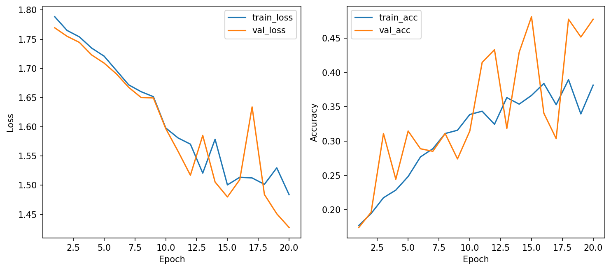
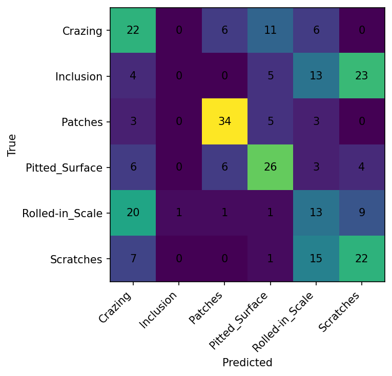

# CSC4005 – Lab 1 Report

## 1. Mục tiêu
Mục tiêu của bài lab là xây dựng một pipeline huấn luyện hoàn chỉnh cho bài toán phân loại ảnh lỗi bề mặt thép sử dụng mạng nơ-ron MLP. 

Bộ dữ liệu sử dụng là NEU Surface Defect Database, gồm 6 lớp:
- Crazing
- Inclusion
- Patches
- Pitted Surface
- Rolled-in Scale
- Scratches

Bài lab tập trung vào:
- Chuẩn bị dữ liệu
- Huấn luyện mô hình
- Theo dõi learning curves
- Phân tích overfitting / underfitting
- So sánh các cấu hình bằng Weights & Biases (W&B)

---

## 2. Cấu hình thí nghiệm

Ba cấu hình được thử nghiệm:

| Run Name        | Optimizer | Learning Rate | Dropout | Weight Decay |
|----------------|----------|--------------|--------|--------------|
| baseline_adamw | AdamW    | 0.001        | 0.3    | 0.0001       |
| dropout_0.5    | AdamW    | 0.001        | 0.5    | 0.0001       |
| sgd_lr0.01     | SGD      | 0.01         | 0.3    | 0.0001       |

Tất cả các cấu hình sử dụng:
- Epochs: 20
- Batch size: 32
- Image size: 64
- Có data augmentation

---

## 3. Kết quả

### 3.1 Bảng so sánh

| Run            | Best Val Acc | Test Acc | Nhận xét |
|----------------|-------------|----------|---------|
| baseline_adamw | ~0.41       | ~0.35    | ổn định |
| dropout_0.5    | ~0.30       | ~0.18    | underfitting |
| sgd_lr0.01     | **0.48**    | **0.43** | tốt nhất |

---

### 3.2 Learning Curves

Các learning curves cho thấy:
- baseline học ổn định
- dropout cao làm model học kém
- SGD đạt hiệu quả tốt nhất

---

### 3.3 Confusion Matrix

Nhận xét:
- Model dự đoán tốt các lớp như Patches và Scratches
- Lớp Inclusion không được dự đoán đúng lần nào
- Có sự nhầm lẫn giữa các lớp có đặc điểm tương tự

---

### 3.4 Classification Report (Best Model)

- Test Accuracy: **43.33%**
- Macro F1-score: ~0.40

Nhận xét:
- Patches có hiệu suất cao nhất (F1 ≈ 0.74)
- Inclusion có precision và recall bằng 0
- Các lớp còn lại đạt mức trung bình

---

## 4. Phân tích

### 4.1 Cấu hình tốt nhất

Cấu hình `sgd_lr0.01` là tốt nhất vì:
- Đạt val accuracy cao nhất (~0.48)
- Test accuracy cao nhất (~0.43)
- Learning curves ổn định
- Không có dấu hiệu overfitting rõ ràng

---

### 4.2 Overfitting / Underfitting

- baseline: học ổn định, không overfitting
- dropout_0.5: underfitting nặng (accuracy thấp, model học kém)
- sgd_lr0.01: cân bằng tốt giữa train và validation

---

### 4.3 So sánh AdamW và SGD

- AdamW:
  - học ổn định
  - hội tụ chậm hơn
  - accuracy thấp hơn

- SGD:
  - đạt accuracy cao hơn
  - learning curves dao động hơn nhưng hiệu quả tốt hơn

=> Trong thí nghiệm này, SGD cho khả năng tổng quát tốt hơn.

---

## 5. Kết luận

Mô hình sử dụng SGD với learning rate 0.01 được chọn làm mô hình tốt nhất.

Lý do:
- Đạt hiệu suất cao nhất trên validation và test set
- Learning curves ổn định
- Tổng quát hóa tốt hơn so với các cấu hình khác

Tuy nhiên, model vẫn còn hạn chế:
- Không phân biệt được lớp Inclusion
- Cần cải thiện bằng cách sử dụng mô hình mạnh hơn (ví dụ CNN)
